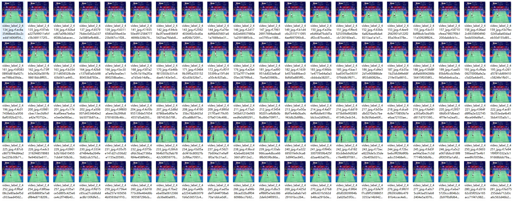
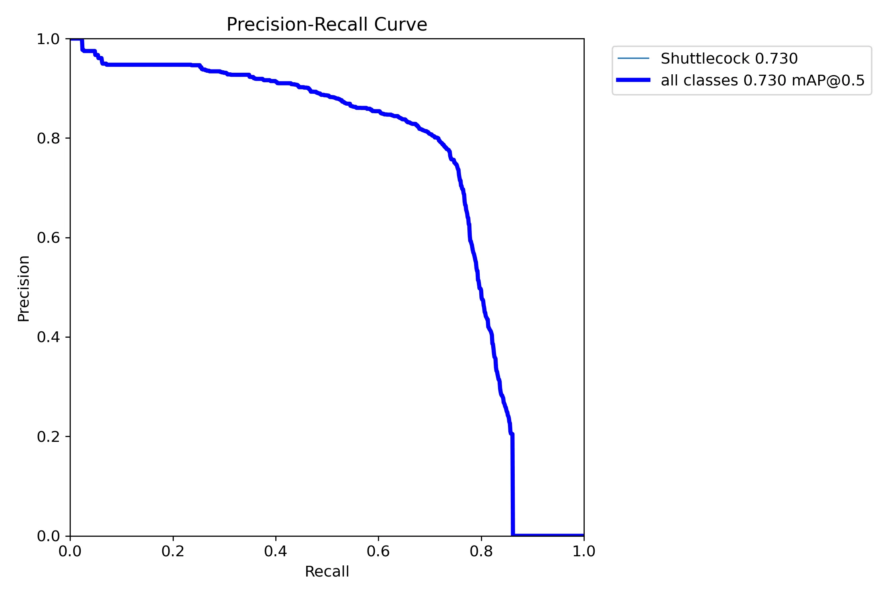
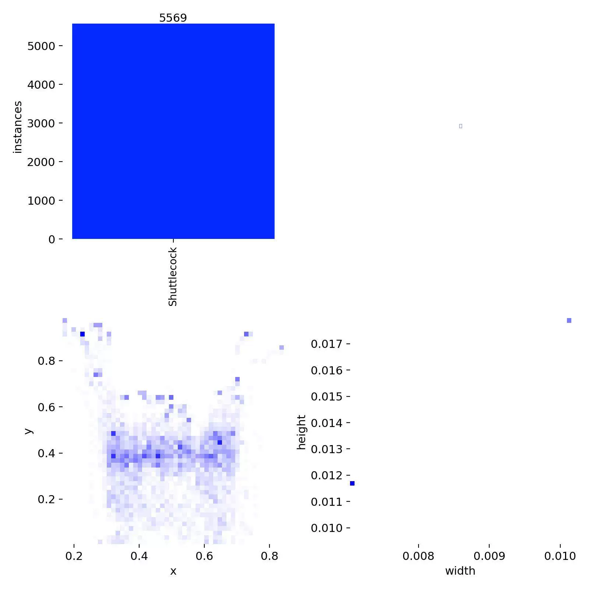
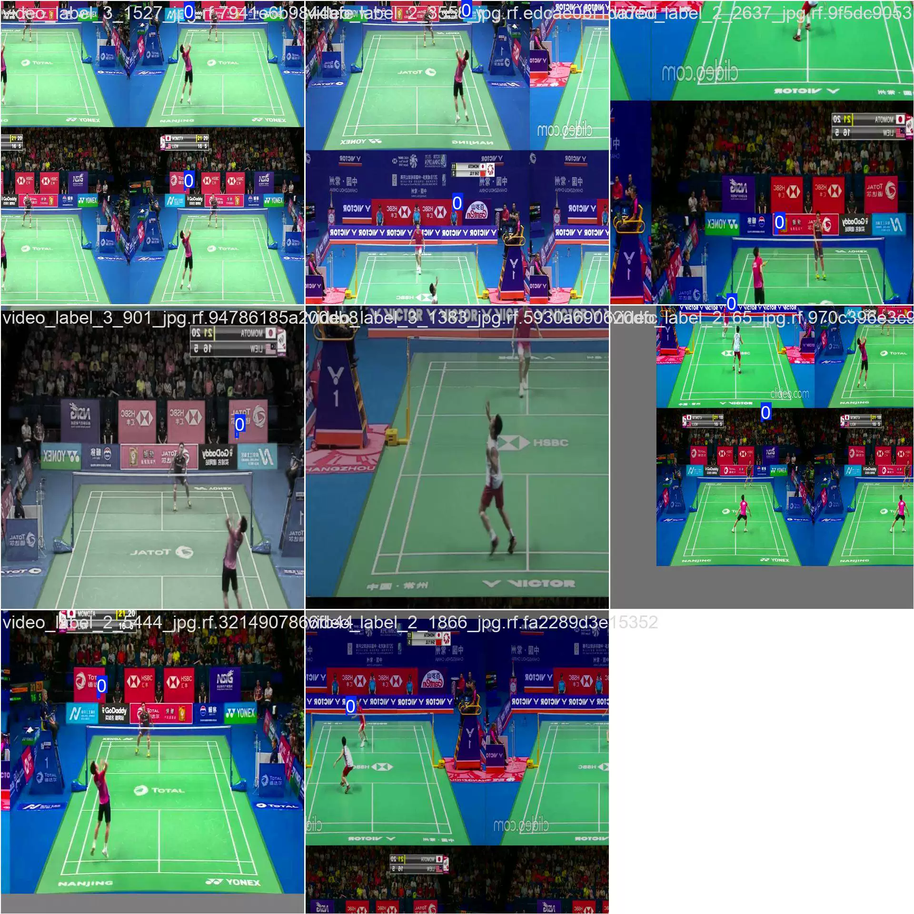
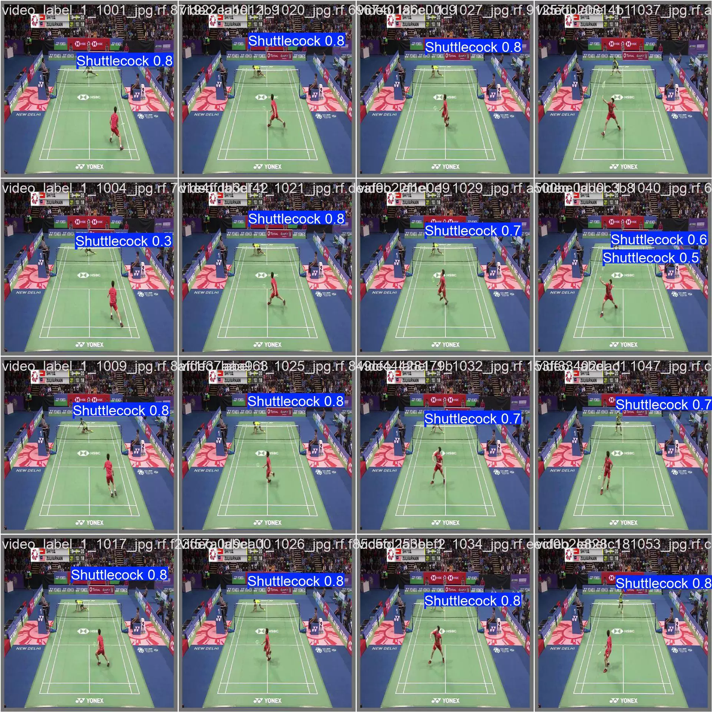
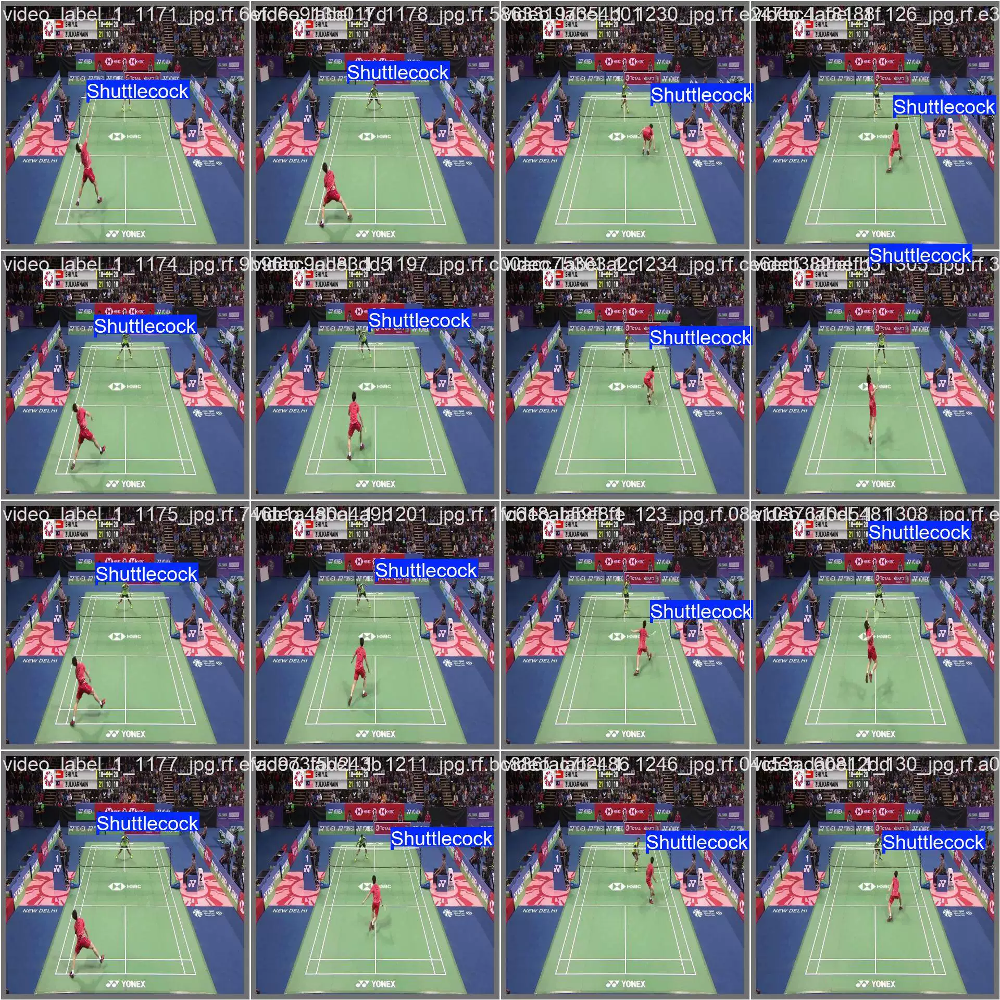
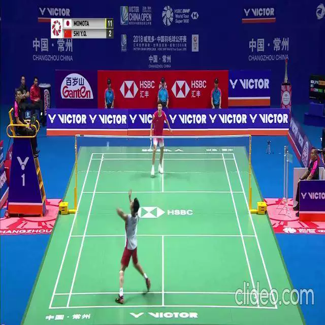

## Body

Badminton Element Recognition Dataset in YOLO format

Totally 8053 images, each labeled with tags. The YOLO format has been well divided into train (5617), valid (1620), and test (816).

It is divided into one category, which are: shuttlecock (badminton)

YOLOv8s Object Detection Weight File (Training rounds 100, pre-trained model YOLOv8s.pt, mAP@0.5 0.730) with training results file

Electronic virtual products sold without return guarantee

## Images

Here is a pay link on Stripe ( https://buy.stripe.com/3cs8yP7sY87d0vu9AB ). Please contact me lonlonago@foxmail.com after funding $89, and I will send you a complete data files , thank you!

